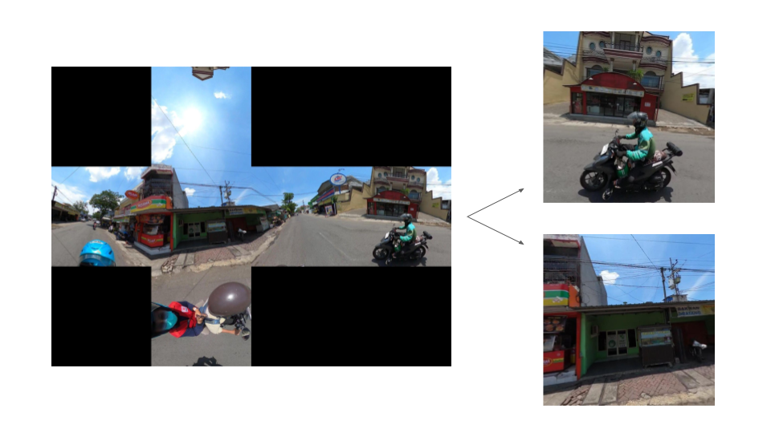
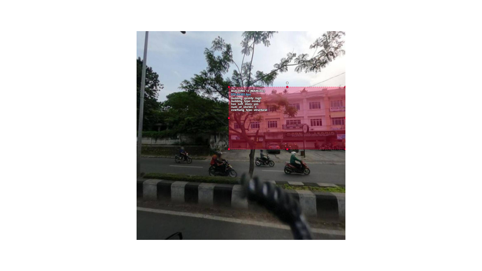
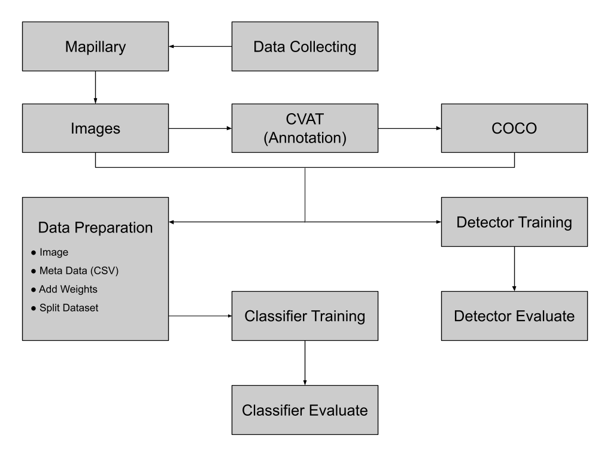
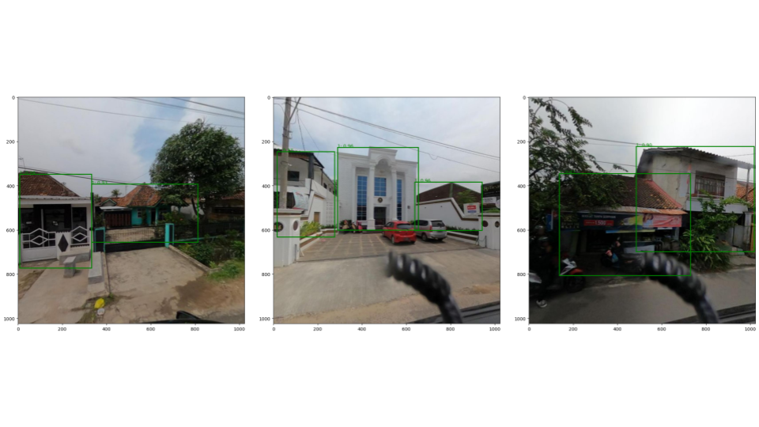

이 프로젝트는 현재 미국 적십자(American Red Cross International Services)에서 진행 중입니다.

[[영문 English]](../project/redcross.qmd)

# 프로젝트 개요

**거리 수준 이미지에서 인사이트를 추출할 수 있는 자동화 도구**를 개발하는 것이 이 프로젝트의 목표입니다.
현재 단계에서는 도시 지역의 기후 관련 재난 위험 저감을 위한 계획 정보 개선에 중점을 두고 있으며 향후 재난 발생 후 영향 평가(Post-Disaster Impact Assessment)로 확장될 수 있는 기반을 마련하는 것이 목표입니다.

# 배경

위성 이미지는 오랫동안 지리 및 공간 데이터를 제공해왔지만 높은 비용과 지상에서 세부 정보 제공에 제한이 있습니다.
거리 수준 이미지는 저렴한 GPS 기능을 갖춘 액션 카메라를 활용하여 효율적으로 고품질 이미지를 수집할 수 있고 건축물과 같은 지상 환경을 상세하게 보여줍니다.
머신러닝과 같은 기술의 발전으로 이제 대규모 시각 데이터를 처리하고 실질적인 인사이트를 추출하는 것이 가능해졌습니다.
인도네시아 적십자(PMI)는 이를 활용하여 예상 도시 열위험 (urban heat risk) 지도를 만드는데 자동화 도구를 적용하려고 합니다.
이 프로젝트는 기후 관련 재난 위험 저감을 위한 계획 수립을 지원하고 재난 발생 후 영향 평가를 위한 기반을 마련하는 것을 목표로 하고 있습니다.

# 데이터 수집 및 전처리

거리 수준의 이미지들은 360° GoPro 카메라를 활용하여 PMI에 의해 수집되었습니다.
수집된 이미지들은 오픈 플랫폼인 Mapillary에 업로드 되었습니다.

360° 이미지에서 건축물이 포함된 측면 프레임만 (상단, 하단, 전면, 후면 제외) 사용 되었습니다.
이렇게 전처리된 이미지들은 모델 개발에 주요 데이터셋으로 사용되었습니다.

# 주석 및 라벨링

CVAT (Computer Vision Annotation Tool)을 사용하여 직접 바운딩박스와 속성 입력 작업을 수행하였으며 주석 데이터는 COCO 형식을 활용하였습니다.
초기 주석 작업을 하기 위해 사전에 재난에 관련된 속성들을 논의하고 정의 했으며 이는 다음과 같습니다.

- Class: Building

- Attributes
    - Building Quality: High, Medium, Informal
    - Building Type: Residential, Commercial, Mixed, Industrial
    - Presence of Soft Story: No, Yes
    - Number of Stories: 0-100
    - Overhang Type: None, Structural, Non-Structural

# 모델 개발

## 모델 개발 개요

이 프로젝트에서 모델은 객체 탐지(Object Detection)와 속성 분류(Classification)를 포함한 두 단계의 파이프라인으로 구성되어 있습니다.

## 객체 탐지 Object Detection

많은 객체 탐지 모델들이 소개되었고 이 프로젝트에서는 Faster R-CNN, RetinaNet, YOLOv8, 그리고 YOLOv11와 같은 아키텍쳐들을 시험했습니다.
효율성과 정확성을 고려하여 Detectron2의 프레임워크를 사용한 **Faster R-CNN**을 선정했고 이를 사용하여 초기 모델을 구상했습니다.
Detectron2의 Model Zoo에서 사전 학습된 모델을 fine-tune 하였고 mAP(mean Average Precision) 지표로 성능을 평가했습니다.

이 모델은 모델은 mAP 0.76을 보여주며 높은 탐지 성능을 보여주었습니다.

## 분류 Classification

ConvNeXt V2 Tiny 아키텍처를 기반으로 한 분류 모델 프레임워크가 구현되었으며 이는 Development Seed의 Housing Passport 프로젝트에서 사용된 접근 방식을 참고한 것입니다.
이 모델은 앞서 언급한 재난 관련 건물 속성을 분류하도록 설계되었습니다.
전체 파이프라인과 학습 코드는 구축되었지만 속성별 데이터 샘플 수가 제한적이어서 아직 본격적인 학습은 진행되지 않았습니다.
충분한 데이터가 확보되면 속성 카테고리에 대한 재학습 및 성능 평가를 할 예정입니다.

  

# 진행 상황 및 향후 계획

현재 저희 팀은 다른 진행 중인 업무에 집중하고 있으며 데이터셋 준비 작업은 잠시 보류된 상태입니다.
추가 이미지와 어노테이션 데이터가 확보되면 모델 재학습 단계가 재개될 예정입니다.
다음 단계에서는 데이터셋 정제, 어노테이션 검증, 탐지 및 분류 모델 개선을 통해 정확도와 일반화 성능을 높이는 작업이 진행됩니다.

추후에 모델 성능이 충분히 검증되면 오픈소스로 배포하여 재난 대비와 대응에 활용할 계획입니다.

# 기술 스택

|  | Tools / Frameworks | Description |
|-----------|--------------------|--------------|
| **프로그래밍 언어** | Python | 데이터 처리 및 모델 개발 핵심 언어 |
| **데이터 라벨링** | CVAT | 건물 속성 및 바운딩 박스 라벨링 |
| **객체 탐지** | Detectron2 | 객체 탐지 모델 개발 및 평가 |
| **분류** | PyTorch | 건물 속성 분류 모델 개발 |
| **데이터** | Mapillary API | 거리 수준 이미지 데이터 |
| **협업 / 버전관리** | GitHub, Hugging Face, Google Drive, Slack | 코드, 데이터셋, 모댈, 팀 협업 |
| **참고** | Development Seed’s Housing Passport | 프로젝트 개념 및 구조 |

# 평가

이 프로젝트를 통해 고품질 데이터셋 구축의 중요성을 다시 한번 확인할 수 있었습니다.
인도네시아 전역에 적용 가능한 모델을 개발하려면, 지역별, 구조 유형별로 다양한 건물 이미지를 포함하는 것이 필수적입니다.
이미지 수집은 완료되었지만 학습용 데이터셋 준비는 아직 최종적으로 완료되지 않은 상태입니다.
이번 과정을 통해 모델 성능은 단순히 알고리즘뿐만 아니라 데이터 자체의 품질이 크게 작용한다는 것을 발견했습니다.
강력한 데이터 기반을 구축하는 것은 정확하고 실무에 확장 가능한 모델 개발을 위한 핵심 단계가 될 것입니다.

# 요약

360° 거리 수준 이미지를 처리하고 건물을 탐지하며 재난 취약성과 관련된 구조 속성을 분류하는 전체 파이프라인을 개발했습니다.
딥러닝, 크라우드소싱, 지리공간 분석을 결합하여 AI 기반 도시 위험 평가를 위한 자동화된 도구를 구축하고 있습니다.

# 참고

- American Red Cross International Services
- Development Seed
- PMI (Indonesian Red Cross Society)